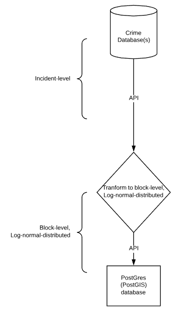
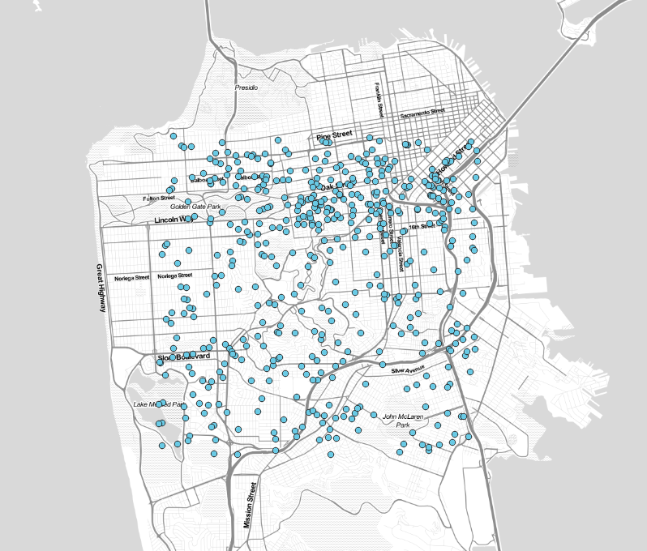
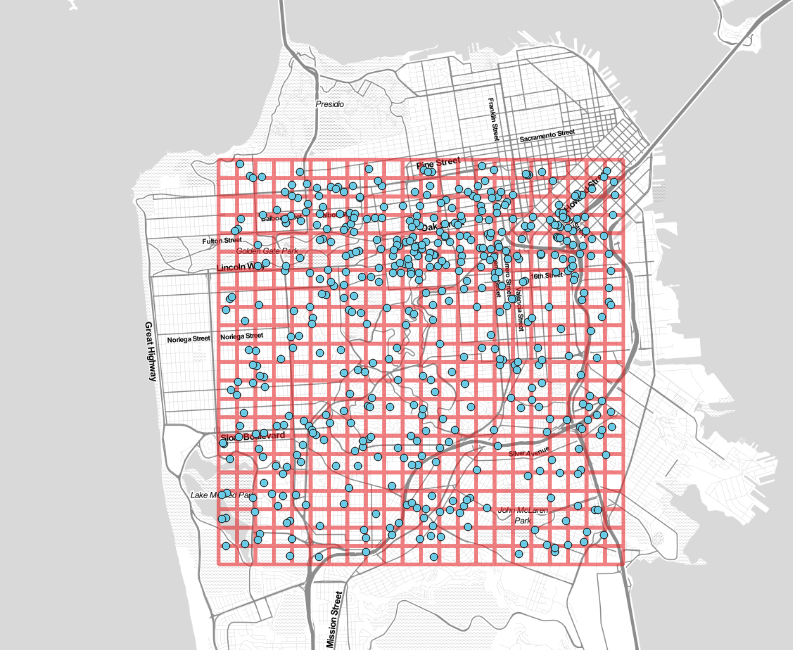
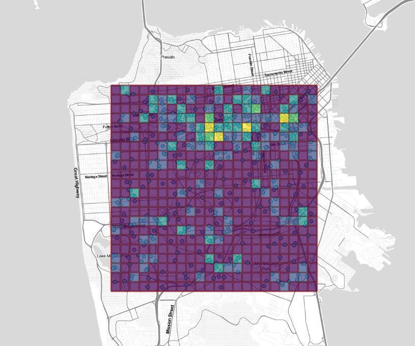

```{r include=FALSE}
library(tidyverse)
library(poweRlaw)
```


\newpage

# Overview
## Reasons for development
This model can be explained in terms of requirements and solutions. The mobile application called **Ask Scout** ("Scout") developed by Civitas Secure ("CS") requires regular indicators of relative risk over a geospatial area, typically a city or municipality. Since this requirement is not currently satisfied by any data sources or products on the market or known to the author, a data model known as **Arkadin** was developed as a solution. 

## High-level process
Incident-level crime data is gathered from various sources such as socrata.com, pulled into a local R computing environment, transformed into a block-level, log-normal distributed data structure, and finally posted to a PostGres/PostGIS database. 

```{r echo=FALSE, message=FALSE, warning=FALSE, out.height= "400px"}

```

## Technology
While this model could be built with a number of computing languages, the R language was the primary programming language utilized. Various R packages such as SF, SP and Tigris provide the GIS support needed within the model. 

# Process
In this section, we will document the entire model from start to finish, ingestion to data output. The model can be separated into three distinct operations: *Munge*, *Arkadin*, and *Post*. 

## Munge operation
The munge operation ingests the incident-level data, normalizes the data structure, and performs classification with a machine learning model. 

The incident-level data enters the model as a separate data set for each city or municipality. This is due to the fact that each city reports their data independently, and the context of knowing a risk level within a particular city is optimal.

### Ingestion
First, data is ingested into the local R computing environment via a connection to an API provided by the incident-level crime vendor - typically Socrata. The amount of data ingested for each separate city varies; the objective is to ingest a statistically-significant and representative sample size. 

In order to produce a robust sample size and also limit complexities in the code base, a simple logic is employed of using a sample size of 10k records, or $1/4 \times population$, whichever is larger. In testing, the model has produced almost identical results from this sampling as it did using the full dataset. 

### Data structure normalization
After the data set is ingested, traditional data munging functions are applied, primarily using the *tidyverse* suite of R packages. Depending on the native data structure, columns may be renamed or dropped, data types may be modified, etc. This process tends to vary from city to city, depending on proclivities in the source data.

### Classification with machine learning
At this point, the incident-level data set is tidy: columns are in a consistent format and data types are in-order. Socrata and other vendors do provide some level of classification for each incident, such as "assault", "battery," etc. Ask Scout requires all incident-level data to be classified as one of four types: personal, property, auto or social. 

A naive bayes classifier machine learning model is employed at this stage to classify each incident as one of the four crime types. The crime description from the incident-level data is utilized as the input to the model. See below for a quick look at the conditional probability model in Bayesian probability terminology. The model utilized is based off of the *quanteda* R package.

$$posterior = \frac{prior \times likelihood}{evidence}$$

A large set of training data was labeled and used as input to build the model used here. The trained model is used to classify all new inputs, specifically the incident descriptions.

This model creates a new field in the data set that indicates which type of crime that incident is attributed to. At this point, each of these data sets are then placed in a staging directory in flat file format in order to be immediately used as input for the next operation.

For more information on this Bayesian approach to document classification see:[@Manning].

## Arkadin operation
At this step, we have a collection of data sets with identical structures, which is essential for our next steps. In the Arkadin operation the model takes a data set and applies various transformations to the data so that Ask Scout can query this data from a database. 

We will separate this Arkadin operation into five parts: *grid construction, split by type, point aggregation, log transformation, rescaling,* and *calculate centroids.*

Note that for the rest of this operation we will use a single city as the context. This operation will be completed independently for each city or municipality.

### Grid construction
For our example data, we will use San Francisco as our city of record. Our incident-level data could look something like this at this stage:

```{r echo=FALSE, message=FALSE, warning=FALSE, out.height= "300px"}

```

Each point represents one crime incident. We need to be able to aggregate these points to build a risk score for individual areas of the city. At this point, the model contructs a grid encompassing the entire area with centroids roughly 500 meters equidistant:


```{r echo=FALSE, message=FALSE, warning=FALSE, out.height= "300px"}

```

This grid or division of a windows into non-overalapping regions is called a *tesselation*  (latin *tesserae*) and the extent of the grid is the *bounding region*, or *bounding box*.

### Split by type
Next, the data set for San Francisco is split four-ways: by crime type (personal, property, auto, social). The data is split so that as it flows through the model, an independent Scout Score can be calculated for each crime type. 

### Point aggregation
For each crime type subset of the San Francisco data, we need to aggregate the points for each square in the grid, known as a *tile*. For each tile, we need to count the number of points that intersect it, using an intersection function. The operation can be summarized:

$$f(\tau) = \sum_{i = 1}^n [p_i \cap \tau]$$
where $\tau$ is a singular tile and *p* is all points in the city.    

These aggregations provide a count of crime incidents for each tile. These counts need further transformation.

### Log transformation
In most cities, there is extreme clustering of crime incidents in certain areas. The distribution of these points very much follows a power distribution like the following:

```{r echo=FALSE, message=FALSE, warning=FALSE, out.height= "300px"}
y <- poweRlaw::rpldis(100, xmin=2, alpha=2.5)
x <- seq(1,100,1)
df <- tibble(x = x, y = y)

ggplot(df) +
  geom_density(aes(y)) +
  xlim(c(0, 100)) +
  theme_minimal() +
  xlab("Incident count per tile") +
  ylab("Density") +
  ggtitle("Power distribution of counts after aggregation")

# Create matrix of vals to knit
mat <- matrix(data = df$y, nrow = 10, ncol = 10)
knitr::kable(x = mat, caption = "Matrix of counts after aggregation" )
```

In this power-type distribution, extreme, infrequent outliers exist that tend to throw off any summary statistics for the tiles as a whole. This necessitates a transformation in the values to reflect a more moderate distribution - to put it plainly - shave off the magnitude of some of the large outliers to bring the distribution into a more normal configuration. 

A *log* transformation - in our case, log10 - is now applied to the previously aggregated counts of incidents by tile. A log10 transformation is the inverse function to exponentiation, and is also known as the *common logarithm*. It is often used to transform data sets such as this one. Log10 can commonly be expressed as such:

$$log_bx = \frac{log_{10}x}{log_{10}b}$$

This log10 transformation transforms the matrix of values above into the following:

```{r echo=FALSE}
df.log <- round(log10(df$y), 3)

# Create matrix of vals to knit
mat <- matrix(data = df.log, nrow = 10, ncol = 10)
knitr::kable(x = mat, caption = "Matrix of counts after log10" )
```

These compressed values are much easier to work with. 

### Rescaling
After the log10 transformation, we have a data set with moderated values, that is, compressed on the long tail. The last transformation is necessary to develop a "Scout Score" of 0 to 100. This Scout Score is the proprietary name for the final output from this model. 

To transform this now-log10-normalized data, we need to use a re-scaling function. 

$$f(x) =  \frac{min(x)}{max(x) - min(x)} \times 100$$

where x is a vector of log10-normalized data. This provides a 0-100 score for each tile in the data set.

```{r echo=FALSE}
df.log <- df.log

df.scaled <- reshape::rescaler(df.log, "range")
df.scaled <- round(df.scaled * 100, 0)
# Create matrix of vals to knit
mat <- matrix(data = df.scaled, nrow = 10, ncol = 10)
knitr::kable(x = mat, caption = "Matrix of counts after scaling" )
```

At this stage, we have a much better log-normal distribution of values:

```{r echo = F}
x <- seq(1, 100, 1)
y <- df.scaled
df <- tibble(x = x, y = y)


ggplot(df) +
  geom_density(aes(y)) +
  xlim(c(0, 100)) +
  theme_minimal() +
  xlab("'Scout Score'") +
  ylab("Density") +
  ggtitle("Log-normal distribution of Scout Scores after log10 & scaling")


```

If you were to make a heatmap using these values, you would see a well-distributed display of risk like the following:

```{r echo=FALSE, message=FALSE, warning=FALSE, out.height= "300px"}

```

where the warmer colors indicate higher values, and the cooler colors indicate lower values.

### Calculate centroids
At this stage, for each of the tiles in the bounding box, there will be a value between 0-100. This is the indicator of risk for that area, determined by apriori association. The final step in this operation is to calculate the centroids of each tile. This allows us to store POINT data instead of the more memory-intensive POLYGON data that it is currently in.

A centroid is the point in the tile where $(\overline{x},\overline{y})$, that is, the mean of all points *x* and *y* within that tile. This can be defined more formally as such:

$$C = (\frac{b}{2} , \frac{h}{2})$$

where *b* is base of tile and *h* is height of tile.

### Context
So far we've calculated the *overall* measure of risk for each tile, with a timeframe of nine months, on average. But, the application requires aggregation by day of week and by hour. Therefore, we must perform the above operation over another grouping of the same base data.

#### Daily aggregation
The goal of the daily aggregation is to provide a measure of risk for each day of the week. To accomplish this, the model also aggregates the base data by day of week. The output is a risk score for each tile (centroid), by each day of the week.

#### Hourly Aggregation
The same applies for hour of the day; the base data is aggregated by the hour of the day and output is the same.

## Post operation
The terminal operation of the model involves moving the data to a database where the application can query it. The script uploads the output of the previous operations to a PostGres/PostGIS database through a custom API.


# References